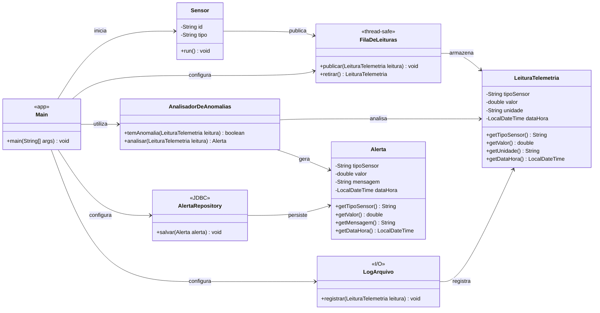

# 🏠 Ninho

**Sistema inteligente de monitoramento de conforto residencial**

O **Ninho** é um projeto desenvolvido para a disciplina de **Programação Orientada a Objetos**, com o objetivo de construir um sistema de recepção e análise de telemetria utilizando **Java**.

O sistema foi pensado para monitorar as condições de ambientes internos de uma residência por meio de dados de:

- 🌡️ Temperatura
- 💧 Umidade
- 💡 Luminosidade

A partir dessas leituras, o sistema identifica condições consideradas anômalas e gera alertas.

O desenvolvimento será realizado de forma incremental, seguindo as etapas semanais propostas na atividade acadêmica.

---

## 🤖 Projeto Ninho

A proposta do Ninho é aplicar os conceitos do trabalho acadêmico em um cenário real de monitoramento residencial.

Além dos sensores simulados previstos na atividade, futuramente o projeto poderá ser integrado a um dispositivo físico equipado com sensores de temperatura, umidade e luminosidade.

O dispositivo também poderá contar com uma matriz de LEDs para representar visualmente informações e estados do ambiente.

---

## 📋 Requisitos do projeto

O Ninho utiliza como base a proposta **Sistema de Telemetria de Sensores**.

O sistema deverá simular sensores que geram leituras em paralelo. As leituras serão enviadas para uma fila central, processadas por um analisador de anomalias e, quando uma condição anômala for identificada, um alerta será gerado e posteriormente persistido.

### Requisitos técnicos obrigatórios

- `Sensor` deve implementar `Runnable`, com cada sensor executando em sua própria thread.
- Deve existir uma fila de leituras thread-safe, como `BlockingQueue`.
- `AnalisadorDeAnomalias` deve ser testável sem depender de threads ou banco de dados.
- Os alertas devem ser representados pela classe `Alerta`.
- A persistência dos alertas deve ser isolada por Repository/DAO utilizando JDBC.
- Todas as leituras devem ser registradas em arquivo de log.
- Devem existir no mínimo 5 testes JUnit para as regras de anomalia.
- O domínio deve permanecer separado da infraestrutura.

> Os requisitos serão implementados progressivamente conforme as etapas do projeto. A presença de um requisito nesta seção não significa que ele já esteja implementado.

---

## 🎯 Rubrica de avaliação

| Critério | Pontuação |
|---|---:|
| Sensores concorrentes sem perda | 1,2 |
| Fila sincronizada e sem deadlock | 1,3 |
| Persistência com JDBC | 1,0 |
| Separação entre domínio e infraestrutura | 0,5 |
| Testes unitários | 0,5 |
| Código e relatório | 0,5 |
| **Total** | **5,0** |
---

## 🚧 Status do desenvolvimento

### ✅ Semana 1 — Domínio e regras de anomalia (TDD)

Na primeira etapa foram desenvolvidas as classes responsáveis pela representação das leituras, alertas e análise das condições monitoradas.

Classes implementadas:

- `LeituraTelemetria`
- `Alerta`
- `AnalisadorDeAnomalias`

As regras foram desenvolvidas utilizando **TDD (Test Driven Development)**, criando testes unitários para validar os comportamentos do domínio.

---

## 📊 Regras de anomalia

Nesta primeira versão foram definidas as seguintes regras:

| Grandeza | Condição considerada anômala |
|---|---|
| 🌡️ Temperatura | Acima de 30 °C |
| 💧 Umidade | Abaixo de 30% |
| 💡 Luminosidade | Abaixo de 100 lux |

Esses limites representam regras iniciais definidas para o projeto e poderão ser ajustados conforme sua evolução.

---

## 🧪 Testes unitários

Os testes foram desenvolvidos utilizando **JUnit 5**.

Atualmente a Semana 1 possui **7 testes unitários**, verificando:

1. Detecção de temperatura alta;
2. Temperatura dentro da condição normal;
3. Detecção de umidade baixa;
4. Umidade dentro da condição normal;
5. Detecção de luminosidade baixa;
6. Geração de um objeto `Alerta` quando uma anomalia é identificada;
7. Não geração de alerta quando a leitura está dentro da condição normal.

Resultado atual dos testes:

```text
Tests run: 7, Failures: 0, Errors: 0, Skipped: 0
BUILD SUCCESS
```

Para executar os testes:

```bash
mvn clean test
```

---

## 🏗️ Estrutura da Semana 1

```text

assistente-de-ambiente/
│
├── AGENTS.md
├── README.md
├── pom.xml
│
└── src/
    ├── main/
    │   └── java/
    │       └── br/com/assistenteambiental/
    │           ├── app/
    │           │   └── Main.java
    │           │
    │           ├── domain/
    │           │   ├── Sensor.java
    │           │   ├── LeituraTelemetria.java
    │           │   ├── Alerta.java
    │           │   └── AnalisadorDeAnomalias.java
    │           │
    │           └── infra/
    │               ├── FilaDeLeituras.java
    │               ├── AlertaRepository.java
    │               └── LogArquivo.java
    │
    ├── test/
    │   └── java/
    │       └── br/com/assistenteambiental/domain/
    │           └── AnalisadorDeAnomaliasTest.java
    │
    ├── database/
    │   └── schema.sql
    │
    └── docs/
        └── RELATORIO.md

```
> Algumas classes já foram criadas para representar a arquitetura planejada do sistema, mas ainda não possuem implementação. As funcionalidades de concorrência, fila, persistência JDBC e logs serão desenvolvidas nas etapas correspondentes.

---

## 🧩 Arquitetura e diagrama de classes

O projeto utiliza separação de responsabilidades entre domínio, infraestrutura e aplicação.

- `domain`: entidades e regras de negócio.
- `infra`: comunicação com recursos externos e mecanismos de infraestrutura.
- `app`: inicialização e integração dos componentes.

A arquitetura foi planejada para manter as regras de negócio independentes de banco de dados, arquivos e mecanismos de concorrência.



---
### Estado compartilhado entre threads

A `FilaDeLeituras` será o principal recurso compartilhado entre as threads dos sensores e o consumidor de leituras.

Na etapa de concorrência, cada `Sensor` será executado em sua própria thread e publicará leituras nessa fila. A implementação da fila deverá ser thread-safe para evitar perda ou duplicação de leituras.

> **Observação:** o diagrama representa a arquitetura planejada do projeto. Algumas classes e operações serão implementadas somente nas etapas posteriores.

---

## 🛠️ Tecnologias utilizadas

- Java 25
- Maven
- JUnit 5
- Programação Orientada a Objetos
- TDD — Test Driven Development
- Git e GitHub para versionamento

---

## 📅 Cronograma de desenvolvimento

O desenvolvimento do Ninho será realizado de forma incremental, seguindo as etapas propostas para a disciplina.

| Semana | Etapa | Status |
|---|---|---|
| 1 | Domínio básico e regras de negócio | ✅ Concluída |
| 2 | Organização em pacotes, DDD e testes | ⏳ Próxima etapa |
| 3 | Threads e execução concorrente dos sensores | ⏳ Pendente |
| 4 | Sincronização, estado compartilhado e prevenção de deadlocks | ⏳ Pendente |
| 5 | Persistência JDBC e I/O de arquivos | ⏳ Pendente |
| 6 | Testes de estresse e testes finais | ⏳ Pendente |
| 7 | Relatório e vídeo de apresentação | ⏳ Pendente |

---

## 🔜 Próxima etapa

A próxima etapa do projeto será dedicada ao refinamento da arquitetura, organização dos pacotes, aplicação dos conceitos de DDD e ampliação dos testes.

Antes da implementação da concorrência, serão revisadas as responsabilidades das classes e a separação entre domínio, infraestrutura e aplicação.

A implementação das threads dos sensores e do modelo produtor-consumidor está prevista para a etapa seguinte.

---

## 🎓 Contexto acadêmico

Projeto desenvolvido como atividade do **2º Bimestre da disciplina de Programação Orientada a Objetos**.

O projeto trabalha progressivamente conceitos como:

- Modelagem de domínio;
- Programação Orientada a Objetos;
- Test Driven Development;
- Testes unitários;
- Multithreading;
- Sincronização;
- Entrada e saída de arquivos;
- Persistência de dados com JDBC.

---

## 👨‍💻 Autor

**Guilherme Leal**
**RA: 25216067-2**

Projeto acadêmico desenvolvido para fins de aprendizagem e aplicação prática dos conceitos de Programação Orientada a Objetos.